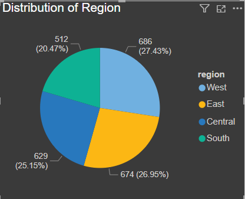
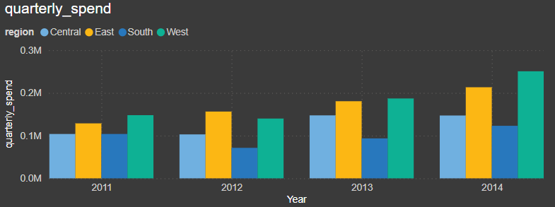

# Sales Performance Dashboard

## Introduction
This project provides a comprehensive analysis of sales performance, utilizing PowerBI to create dynamic and insightful visualizations. The dashboard aims to highlight key metrics, trends, and performance indicators, enabling data-driven decision-making.

🔍 Explore the PowerBI dashboard and insights into sales performance here: [sales_analysis.pbix](sales_analysis.pbix)

## Background
In today's competitive market, understanding sales performance is crucial for driving growth and achieving business goals. This project focuses on analyzing sales data to identify top-performing products, sales trends, and key performance indicators (KPIs).

Through detailed analysis and visualization, this project aims to provide a clear picture of sales performance, helping businesses make informed decisions and optimize their sales strategies.

The data is sourced from a CSV file containing information on sales transactions, product details, and customer demographics.

The questions I aimed to answer through my analysis were:
- What are the top-performing products?
- What are the sales trends over time?
- Which regions are generating the highest sales?
- What is the average sales value?

## Tools I Used
- **PowerBI**: Used for creating dynamic visualizations and dashboards.
- **Excel**: Utilized for data cleaning and preparation.
- **SQL**: Employed for querying and manipulating data.
- **Git & GitHub**: Essential for version control and collaboration.

## The Analysis
In this project, I approached each analysis with the goal of uncovering specific insights from the sales data. Here's how I tailored each query and visualization to address different aspects of sales performance:

### Dataset
The dataset used for this project is [Superstore.csv](./csv%20file/Superstore.csv), which contains detailed sales transaction records, including customer, product, and regional information.

### SQL Queries
#### 1. Total Spend per Customer
To identify the total spend per customer, I summed the sales for each customer.
```sql
SELECT
    Customer_ID,
    ROUND(SUM(sales)) AS Total_Spend
FROM 
    superstore
GROUP BY
    Customer_ID
ORDER BY
    Total_Spend DESC
LIMIT 10;
```

*As it is clear from the image Customer ID SM- 20320 is the biggest spender.*

*Visualized using Power BI*

#### 2. Purchase Frequency per Customer
To determine the purchase frequency per customer, I counted the number of orders for each customer.
```sql
SELECT 
    Customer_ID, 
    COUNT(Order_ID) AS Purchase_Frequency
FROM 
    superstore
GROUP BY 
    Customer_ID
ORDER BY
    Purchase_Frequency DESC;
```


*As it is clear from the image Customer ID WB-21850 is the most frequent buyer*

#### 3. Summary of Customer Spending and Frequency
I created a summary table to store each customer's total spend, purchase frequency, average purchase value, region, and segment.
```sql
CREATE TABLE Customer_Summary AS
SELECT 
    Customer_ID, 
    ROUND(SUM(Sales)) AS Total_Spend, 
    COUNT(Order_ID) AS Purchase_Frequency,
    ROUND(AVG(Sales)) AS Avg_Purchase_Value,
    MAX(Region) AS Region,
    MAX(Segment) AS Segment
FROM 
    superstore
GROUP BY 
    Customer_ID
ORDER BY
    Total_Spend DESC
LIMIT 10;
```
## Customer Data

| Customer ID | Total Spend | Purchase Frequency | Average Purchase Value | Region | Segment      |
|-------------|-------------|--------------------|-------------------------|--------|--------------|
| SM-20320    | $25,043     | 15                 | $1,670                  | West   | Home Office  |
| TC-20980    | $19,052     | 12                 | $1,588                  | West   | Corporate    |
| RB-19360    | $15,117     | 18                 | $840                    | West   | Consumer     |
| TA-21385    | $14,596     | 10                 | $1,460                  | East   | Home Office  |
| AB-10105    | $14,474     | 20                 | $724                    | West   | Consumer     |
| KL-16645    | $14,175     | 29                 | $489                    | West   | Consumer     |
| SC-20095    | $14,142     | 22                 | $643                    | West   | Consumer     |
| HL-15040    | $12,873     | 11                 | $1,170                  | South  | Consumer     |
| SE-20110    | $12,209     | 19                 | $643                    | West   | Consumer     |
| CC-12370    | $12,129     | 11                 | $1,103                  | West   | Consumer     |

#### 4. High-Value Customers
To identify high-value customers, I selected the top 20% of customers based on total spend.
```sql
SELECT Customer_ID, ROUND(Total_Spend) AS total_spend
FROM Customer_Summary
ORDER BY Total_Spend DESC
LIMIT (SELECT COUNT(*) FROM Customer_Summary) / 5;
```


*The top 20% of customers are the ones with the highest total spend*


#### 5. Customer Demographics
I grouped customers by region and segment.
```sql
SELECT 
    Customer_ID, 
    Region, 
    Segment
FROM 
    superstore
GROUP BY 
    Customer_ID, 
    Region, 
    Segment
LIMIT 20;
```


*The customer demographics are grouped by region and segment and it is clear from the pie chart that high percentage of customers are from West Region followed by South Region.*

*This was created by me using Power Bi.*

#### 6. Customer Segmentation by Value
I updated the customer summary to categorize customers into high, medium, and low value based on their total spend and purchase frequency.
```sql
UPDATE 
    Customer_Summary
SET 
    Segment = CASE 
               WHEN Total_Spend > 10000 AND Purchase_Frequency > 10 THEN 'High Value'
               WHEN Total_Spend BETWEEN 5000 AND 10000 THEN 'Medium Value'
               ELSE 'Low Value'
              END;
            
```

#### 7. Profile Segments
To profile different customer segments, I calculated the average spend and frequency for each segment.
```sql
SELECT 
    Segment, 
    ROUND(AVG(Total_Spend)) AS Avg_Spend, 
    ROUND(AVG(Purchase_Frequency)) AS Avg_Frequency
FROM 
    Customer_Summary
GROUP BY 
    Segment
ORDER BY
    Avg_Spend DESC;

```
| Segment       | Average Spend ($) | Average Frequency (times per year) |
| ------------- | ----------------- | ---------------------------------- |
| High Value    | 13,323            | 21                                 |
| Medium Value  | 6,671             | 18                                 |
| Low Value     | 2,080             | 12                                 |

#### 8. Regional Sales Performance
To understand regional performance, I summed the total sales and counted the number of orders for each region.
```sql
SELECT 
    Region, 
    ROUND(SUM(Sales)) AS Total_Sales, 
    COUNT(Order_ID) AS Num_Orders
FROM 
    superstore
GROUP BY 
    Region
ORDER BY 
    Total_Sales DESC;
```
| Region  | Total Sales ($) | Number of Orders |
| ------- | --------------- | ---------------- |
| West    | 725,458         | 3,203            |
| East    | 678,781         | 2,848            |
| Central | 501,240         | 2,323            |
| South   | 391,722         | 1,620            |

#### 9. Purchase Trends Over Time
To analyze purchase trends over time, I aggregated sales data by quarter and region.
```sql
SELECT 
    Customer_ID, 
    DATE_TRUNC('quarter', Order_Date) AS Quarter, 
    ROUND(SUM(Sales)) AS Quarterly_Spend,
    region
FROM 
    superstore
GROUP BY
    Customer_ID, 
    DATE_TRUNC('quarter', Order_Date),
    region
ORDER BY
    Quarterly_Spend DESC;
```

*Created by me using PowerBI*

#### 10. Product Preferences by Segment
To determine product preferences by customer segment, I joined the sales data with the customer summary and summed the total sales for each product within each segment.
```sql
SELECT 
    cs.Segment, 
    ss.Product_Name, 
    ROUND(SUM(ss.Sales)) AS Total_Sales
FROM 
    superstore ss
JOIN 
    Customer_Summary cs 
    ON ss.Customer_ID = cs.Customer_ID
GROUP BY 
    cs.Segment, 
    ss.Product_Name
ORDER BY 
    cs.Segment, 
    Total_Sales DESC
LIMIT 30;
```
| Segment     | Product Name                                                 | Total Sales ($) |
|-------------|--------------------------------------------------------------|-----------------|
| High Value  | Canon imageCLASS 2200 Advanced Copier                        | 50,400          |
| High Value  | Cisco TelePresence System EX90 Videoconferencing Unit        | 22,638          |
| High Value  | High Speed Automatic Electric Letter Opener                  | 13,100          |
| High Value  | GBC Ibimaster 500 Manual ProClick Binding System             | 9,893           |
| High Value  | Ibico EPK-21 Electric Binding System                         | 9,450           |
| High Value  | HP Designjet T520 Inkjet Large Format Printer - 24" Color    | 8,750           |
| High Value  | Lexmark MX611dhe Monochrome Laser Printer                    | 8,160           |
| High Value  | Apple iPhone 5                                               | 5,459           |
| High Value  | 3D Systems Cube Printer, 2nd Generation, Magenta             | 5,200           |
| High Value  | DMI Eclipse Executive Suite Bookcases                        | 4,008   

## Sales Performance Insights
Based on the data provided, the following insights were derived:
- **Top Performing Products**: The **Canon imageCLASS 2200 Advanced Copier** 📠, **Cisco TelePresence System EX90** 🎥, and **High Speed Automatic Electric Letter Opener** ✉️ are the top-performing products, significantly driving total sales in the "High Value" segment. 💼

- **Sales Trends**: There is a noticeable increase in quarterly spend across all regions from 2011 to 2014 📅, with the West region showing the most pronounced growth by the final year 📈.

- **Regional Performance**: The West region 🌍 leads in total sales and number of orders, demonstrating the highest regional performance, while the South region 🌴 shows the lowest sales and order volume.

- **Average Sales Value**: The average transaction value is approximately **$229.70** 💵, indicating a healthy sales per transaction rate.


## What I Learned
Through this project, I gained valuable insights into sales performance analysis and the use of PowerBI for creating impactful visualizations. 

## Key Aspects of Sales Analysis

- **Data Cleaning and Preparation**: Ensuring data accuracy and consistency is crucial for meaningful analysis. 🧹🔍

- **Visualization Techniques**: Using PowerBI to create dynamic and interactive dashboards enhances the understanding of sales performance. 📊🔧

- **Sales Trends and Insights**: Identifying trends and patterns helps in making informed business decisions and optimizing sales strategies. 📈💡


## Conclusions
The Sales Performance Dashboard provides a comprehensive view of sales metrics, trends, and key performance indicators. By leveraging PowerBI and PostgreSQL, this project offers valuable insights that can drive business growth and improve sales strategies.

## Closing Thoughts
Understanding sales performance is essential for any business aiming to achieve growth and success. 📈 This project highlights the importance of data-driven decision-making and the power of visual analytics in uncovering insights from sales data. 🔍📊 By continuously monitoring and analyzing sales performance, businesses can stay ahead of the competition and achieve their goals. 🚀💡

---
